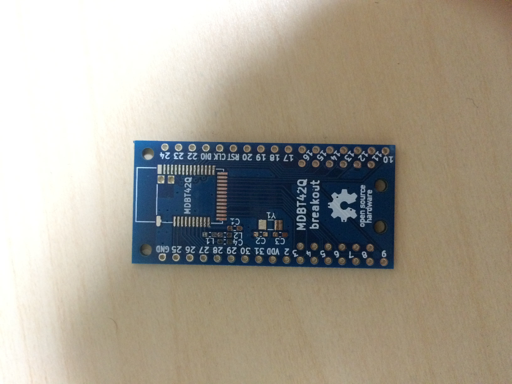
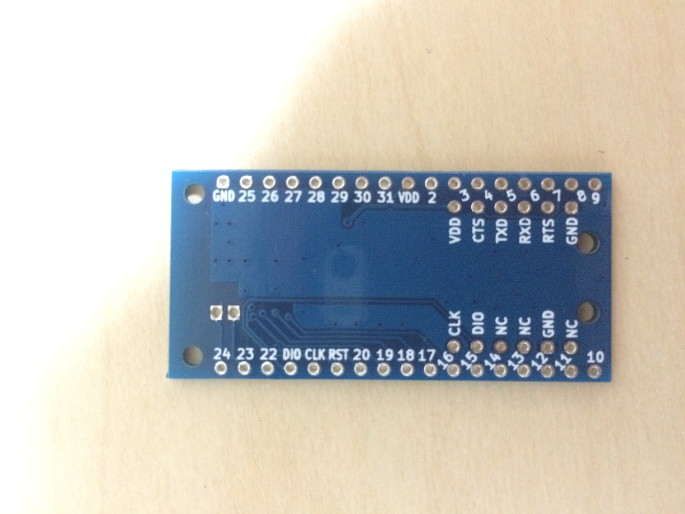
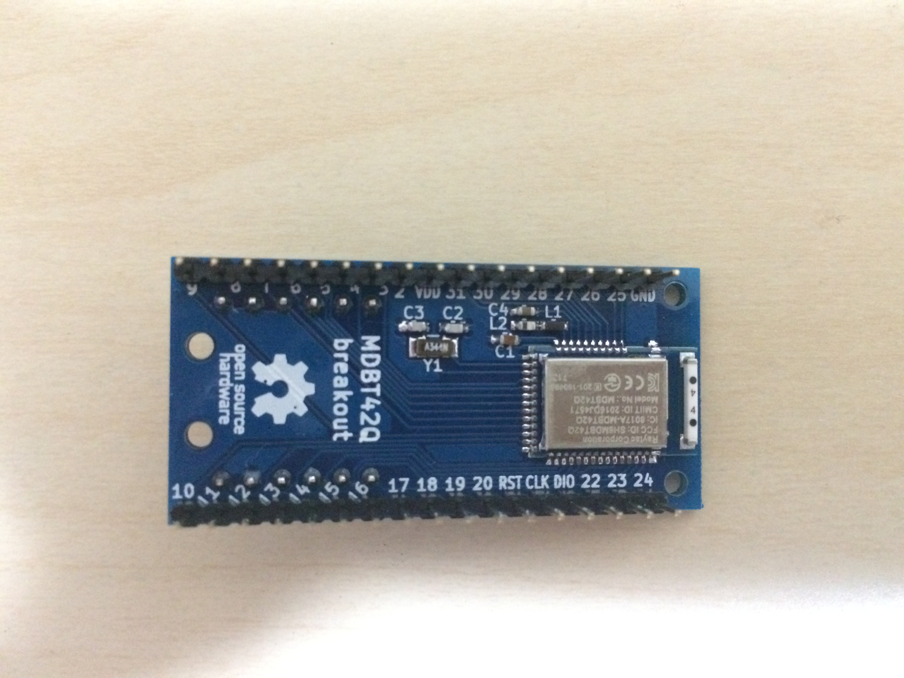
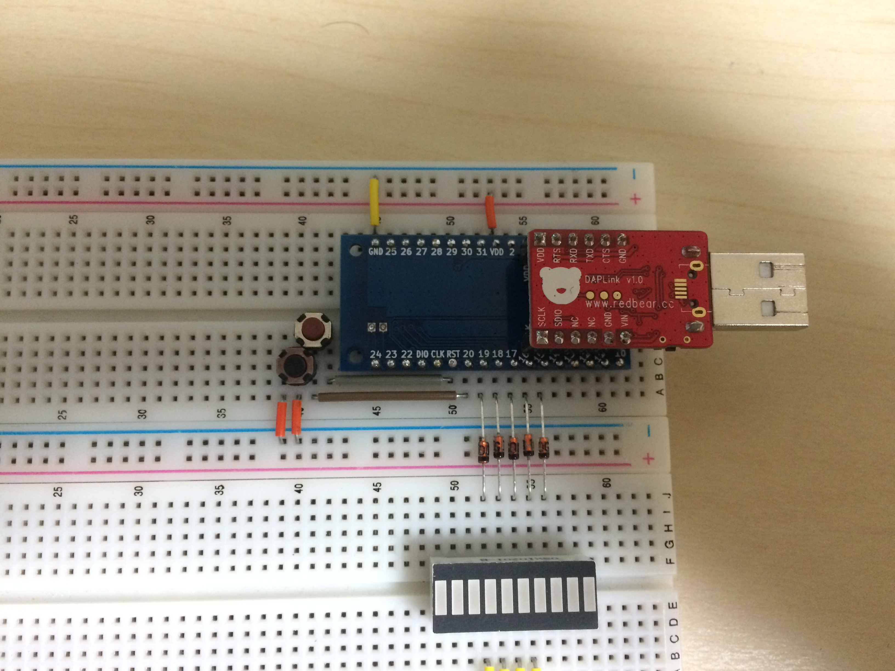
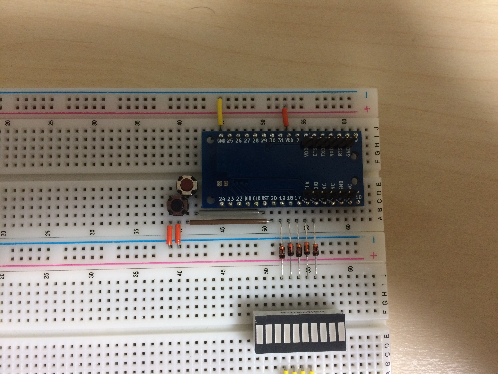

# MDBT42Q-breakout

Raytac社製nRF52832モジュールMDBT42Qのブレークアウト基板です。

RedBearLabのBLE Nanoの書き込み機(Daplink)を直接挿して書き込みできるようにしました。

コンデンサ、インダクタはすべて1608サイズ、水晶振動子はFC-135です。
C2,C3の容量は水晶振動子の負荷容量に合わせて選定してください。
コンデンサはその辺の店に売ってると思いますがインダクタはなかなか厳しいと思いますので私が使用したものの入手先を貼っておきます。

https://www.digikey.jp/product-detail/ja/taiyo-yuden/HK160815NJ-T/587-1547-1-ND/1008162
https://www.marutsu.co.jp/GoodsDetail.jsp?q=HK160815NJ-T&salesGoodsCode=15560264

https://www.digikey.jp/product-detail/ja/taiyo-yuden/LBMF1608T100K/587-1714-1-ND/1008036
https://www.marutsu.co.jp/GoodsDetail.jsp?q=LBMF1608T100K&salesGoodsCode=15560538

## License

https://creativecommons.org/licenses/by/4.0/
